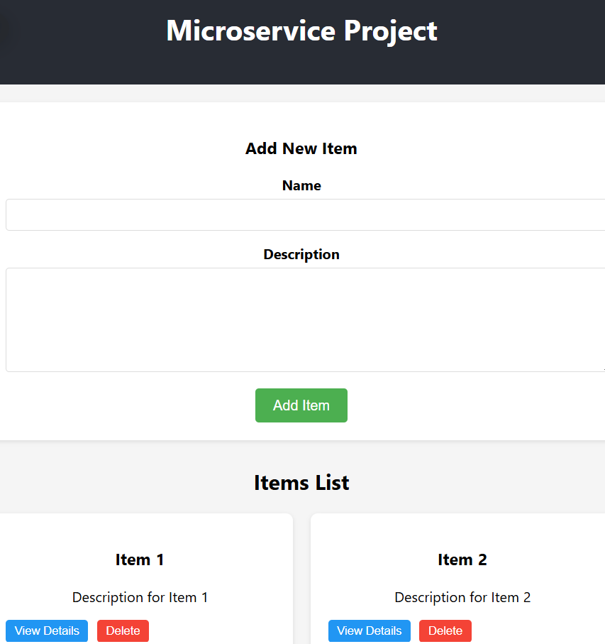

# Microservice Project



A microservice architecture project with Python backend (FastAPI) and React frontend.

## Project Structure

- `backend/` - Python FastAPI microservice backend
- `frontend/` - React frontend application

## Features

- RESTful API with FastAPI
- React frontend with component-based architecture
- Form for adding new items
- Item deletion functionality
- Item detail view with update capability
- API communication between frontend and backend

## Getting Started

### Backend Setup

1. Navigate to the backend directory:
   ```
   cd backend
   ```

2. Install dependencies:
   ```
   pip install -r requirements.txt
   ```

3. Run the server:
   ```
   python run.py
   ```
   The API will be available at http://localhost:8000

### Frontend Setup

1. Navigate to the frontend directory:
   ```
   cd frontend
   ```

2. Install dependencies:
   ```
   npm install
   ```

3. Start the development server:
   ```
   npm start
   ```
   The frontend will be available at http://localhost:3000

## API Endpoints

- `GET /api/items` - Get all items
- `GET /api/items/{item_id}` - Get a specific item
- `POST /api/items` - Create a new item